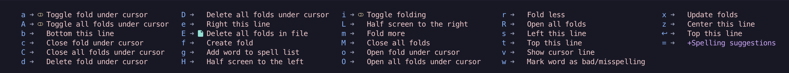

# Installation

### Install dependencies
``` brew install tmux ```

``` brew install neovim ```

To avoid Lazyvim warnings install lua 5.1.5 from source
```
   wget https://www.lua.org/ftp/lua-5.1.5.tar.gz
   tar zxf lua-5.1.5.tar.gz
   cd lua-5.1.5
   make macosx
   sudo make install
```

### Clone repo and install plugins
```
git clone git@github.com:meetorman/terminal-god.git
mv terminal-god/.tmux.conf ~/.tmux.conf
mv terminal-god/.config/nvim ~/.config/nvim
```

# Usage

```
tmux
tmux source-file ~/.tmux.conf # Reload config
nvim
```
`ctrl + b` `2` # Create new pane in bottom

`ctrl + b` `o` # Switch back to nvim


# Key Bindings

## tmux

### Windows


Prefix: `Ctrl + b`
- New window: `c`
- Switch window: `n`
- List windows: `w`
- Rename window: `,`

### Panes


- Prefix: `Ctrl + b`
  - New pane (numpad direction):
    - `1`: bottom left
    - `2`: bottom (horizontal)
    - `3`: bottom right
    - `4`: left (vertical)
    - `6`: right (vertical)
    - `7`: top left
    - `8`: top (horizontal)
    - `9`: top right
  - Switch pane: `o`
- Resize pane: `Shift + Arrow key`

## nvim

Leader key: `Space`

### Windows

Prefix: `Ctrl + w`
- Split horizontally: `s`
- Split vertically: `v`
- Close window: `q`
- Move to window: `h`, `j`, `k`, `l`
- Resize window: `+`, `-`

## Plugins

### which-key
Provides menu for key binding reminders
#### Windows `ctrl + w`

#### Leader `<space>`

#### Miscellaneous `k`


### telescope


UI for searching files, git files, projects, grep, etc
- Find files: `<space>ff`
- Find git files: `<space>fg`
- Find buffers: `<space>fb`
- Find help tags: `<space>fh`
- Find live grep: `<space>fl`
- Find tags: `<space>ft`
- Find recent files: `<space>fr`
- Find word: `<space>fw`
- Find commands: `<space>fc`
- Find: `<space>fm`

### neotree


Explorer - File browser
- Toggle Explorer: `<space>e`

### notify


Display background terminal output in a notification, allows plugins to send notifications
- Usage: `:Notify "message"`

### lualine


Handles top and bottom bar of nvim
- bufferline: Handles the tabs at the top

### chatgpt


For editing, chatting, and explaining
- AI menu: `<space>a`
  - ChatGPT menu: `<space>ag`
    - Edit: `<space>age`
    - Explain: `<space>agd`
    - Chat: `<space>agc`

### neogit


For quick git operations
- Neogit menu: `<space>g`
  - Git stage: `s`
  - Git commit: `cc`
  - Git push: `Pp`
  - Git diff: `d`
  


### lazygit

For more complex git operations (merging conflicts, squashing, etc.)
- Usage: `:LazyGit`

### undo tree


For viewing undo history
- Undo-tree menu: `<space>u`
  - Help: `?`

### Autocompletion
#### CoPilot
- Cycle through suggestions: `Ctrl + n`, `Ctrl + p`
#### COC


