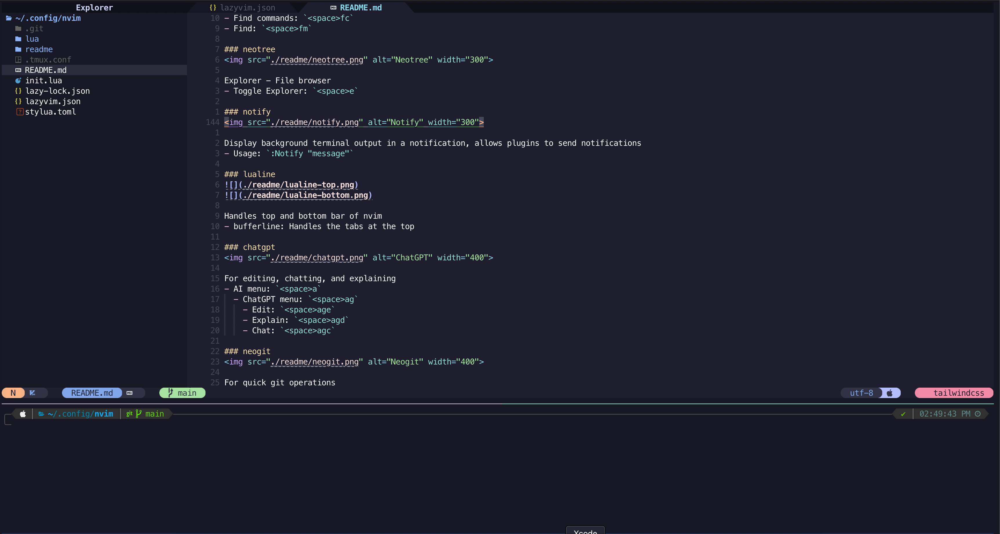
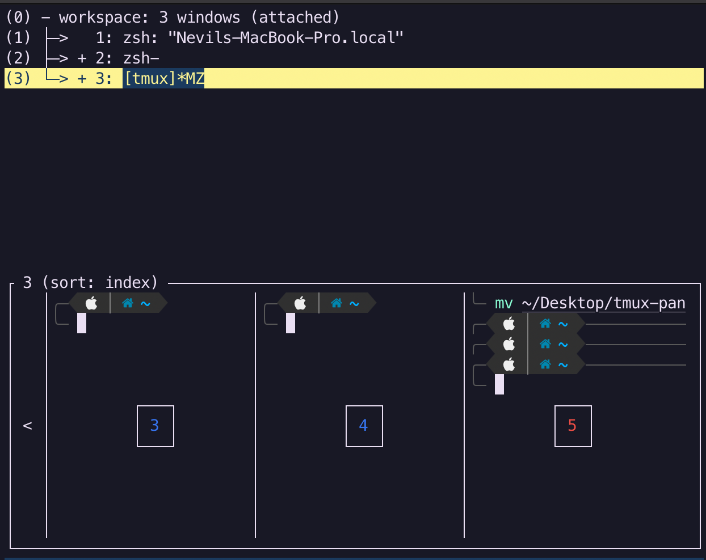
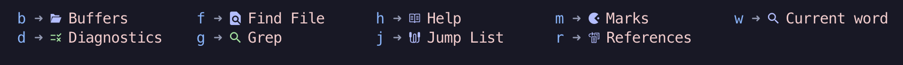
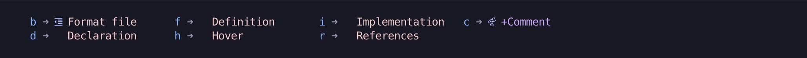

# Table of Contents

- [Installation](#installation)
- [Usage](#usage)
- [Key Bindings](#key-bindings)
  - [tmux](#tmux)
    - [Windows](#windows)
    - [Panes](#panes)
  - [nvim](#nvim)
    - [Windows](#windows-1)
- [Plugins](#plugins)
  - [which-key](#which-key)
  - [telescope](#telescope)
  - [neotree](#neotree)
  - [notify](#notify)
  - [lualine](#lualine)
  - [chatgpt](#chatgpt)
  - [neogit](#neogit)
  - [lazygit](#lazygit)
  - [undo tree](#undo-tree)
  - [Autocompletion](#autocompletion)
    - [CoPilot](#copilot)
    - [COC](#coc)
- [Vim Motions](#vim-motions)
  - [Basic Motions](#basic-motions)
  - [Text Objects](#text-objects)
  - [Operators](#operators)
  - [Combining Operators and Motions](#combining-operators-and-motions)
  - [Advanced Motions](#advanced-motions)
  - [Repeating and Undoing](#repeating-and-undoing)

# Installation

### Option 1: Install with ansible (Preferred)
`````
curl -sL https://raw.githubusercontent.com/meetorman/terminal-god/main/playbook.yml | ansible-playbook -i localhost, /dev/stdin --ask-become-pass
```

### Option 2: Install manually

#### Install dependencies

```
cd /tmp
brew install tmux nvim wget
wget https://www.lua.org/ftp/lua-5.1.5.tar.gz
tar zxf lua-5.1.5.tar.gz
make linuxget https://luarocks.github.io/luarocks/releases/luarocks-3.11.1.tar.gz
cd luarocks-3.11.1
./configure --with-lua=/usr/local/ --lua-version=5.1
make
sudo make install
brew install mercurial ripgrep fd
npm install -g neovim
npm install -g prettier
brew install black isort stylua
brew install php julia composer rust go openjdk
sudo ln -sfn $(brew --prefix)/opt/openjdk/libexec/openjdk.jdk /Library/Java/JavaVirtualMachines/openjdk.jdk
pip3 install neovim  --break-system-package
```


#### Clone repo and install plugins
```
git clone https://github.com/meetorman/terminal-god.git
mv terminal-god ~/.config/nvim
ln -s ~/.config/nvim/.tmux.conf ~/.tmux.conf
```

## Verify installation
Run `nvim` and command `:checkhealth` to verify installation without errors.

If you plan on using CoPilot and ChatGPT

 - Copilot

    - Run command `:Copilot` to authenticate with Github

- ChatGPT

    - Set environment variable `OPENAI_API_KEY` in `.zshrc`

# Usage

```
tmux
tmux source-file ~/.tmux.conf # Reload config
nvim
```
`ctrl + b` `2` # Create new pane in bottom

`ctrl + b` `o` # Switch back to nvim
 <br/>
 <br/>
# Key Bindings

## tmux

### Windows


Prefix: `Ctrl + b`
- New window: `c`
- Switch window: `n`
- List windows: `w`
- Rename window: `,`

### Panes


- Prefix: `Ctrl + b`
  - New pane (numpad direction):
    - `1`: bottom left
    - `2`: bottom (horizontal)
    - `3`: bottom right
    - `4`: left (vertical)
    - `6`: right (vertical)
    - `7`: top left
    - `8`: top (horizontal)
    - `9`: top right
  - Switch pane: `o`
- Resize pane: `Shift + Arrow key`

## nvim

Leader key: `Space`

### Windows

Prefix: `Ctrl + w`
- Split horizontally: `s`
- Split vertically: `v`
- Close window: `q`
- Move to window: `h`, `j`, `k`, `l`
- Resize window: `+`, `-`

## Plugins

### which-key
Provides menu for key binding reminders
#### Leader `<space>`

#### Windows `ctrl + w`

#### Miscellaneous `k`

#### Telescope `<space>f`

#### Language (LSP) `<space>l`


### telescope


UI for searching files, git files, projects, grep, etc

- Telescope menu: `<space>f`
  - Find files: `<space>ff`
  - Find buffers: `<space>fb`
  - Find help tags: `<space>fh`
  - Find live grep: `<space>fg`
  - Find current word: `<space>fw`
  - Find references: `<space>fr`
  - Find marks: `<space>fm`
  - Find diagnostics: `<space>fd`
  - Find jump list: `<space>fd`


### neotree


Explorer - File browser
- Toggle Explorer: `<space>e`

### notify


Display background terminal output in a notification, allows plugins to send notifications
- Usage: `:Notify "message"`

### lualine


Handles top and bottom bar of nvim
- bufferline: Handles the tabs at the top

### chatgpt


For editing, chatting, and explaining
- AI menu: `<space>a`
  - ChatGPT menu: `<space>ag`
    - Edit: `<space>age`
    - Explain: `<space>agd`
    - Chat: `<space>agc`

### neogit


For quick git operations
- Open Neogit: `<space>g`
  - Git stage: `s`
  - Git commit: `cc`
  - Git push: `Pp`
  - Git diff: `d`
  - Help: `?`
  
    

### lazygit

For more complex git operations (merging conflicts, squashing, etc.)
- Usage: `:LazyGit`

### undo tree


For viewing undo history
- Undo-tree menu: `<space>u`
  - Help: `?`

### Autocompletion
#### CoPilot
- Cycle through suggestions: 
    - Next suggestion: `Ctrl + n`
    - Previous suggestion: `Ctrl + p`
#### COC


 <br/>

# Vim Motions

Vim motions are commands used to navigate and manipulate text efficiently. They are a fundamental part of Vim's modal editing philosophy.

### Basic Motions

- `h`, `j`, `k`, `l`: Move left, down, up, right
- `w`: Move to the beginning of the next word
- `b`: Move to the beginning of the previous word
- `e`: Move to the end of the current/next word
- `0`: Move to the beginning of the line
- `$`: Move to the end of the line
- `gg`: Go to the first line of the document
- `G`: Go to the last line of the document

### Text Objects

Vim allows you to operate on "text objects" such as words, sentences, and paragraphs.

- `iw`: "inner word"
- `aw`: "a word" (includes surrounding space)
- `is`: "inner sentence"
- `as`: "a sentence"
- `ip`: "inner paragraph"
- `ap`: "a paragraph"

### Operators

Operators are commands that perform actions on text objects or motions.

- `d`: Delete
- `c`: Change (delete and enter insert mode)
- `y`: Yank (copy)
- `>`: Indent
- `<`: Unindent

### Combining Operators and Motions

The power of Vim comes from combining operators with motions or text objects. For example:

- `dw`: Delete word
- `ci"`: Change inside quotes
- `ya{`: Yank around curly braces
- `>ip`: Indent paragraph

### Advanced Motions

- `f{char}`: Move to the next occurrence of {char} on the current line
- `F{char}`: Move to the previous occurrence of {char} on the current line
- `t{char}`: Move to just before the next occurrence of {char}
- `T{char}`: Move to just after the previous occurrence of {char}
- `%`: Move to the matching parenthesis, bracket, or brace

### Repeating and Undoing

- `.`: Repeat the last change
- `u`: Undo the last change
- `Ctrl + r`: Redo the last undone change
